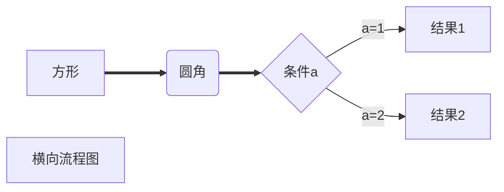
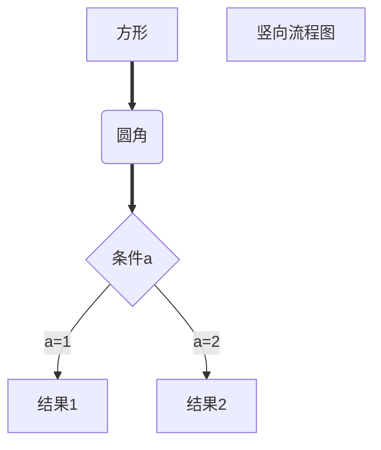

this is my blog

# markdown的使用说明

## 一、标题

语法：# (一级标题)  ## (二级标题)  ### (三级标题) ......

代码：

```text
# 这是一级标题
## 这是二级标题
```

效果:  

# 这是一级标题

## 这是二级标题

快捷键:

* Ctrl+数字1~6可以快速将选中的文本调成对应级别的标题
* Ctrl+0可以快速将选中的文本调成普通文本
* Ctrl+加号/减号对标题级别进行加减

## 二、段落

### 1、换行

代码:  
```text
这是一个段落
这是一个段落
```

效果: 

这是一个段落
这是一个段落

### 2、分割线
语法:  ---或者***+回车

代码:
```text
---或者***
```

效果:

---

## 三、文字显示

### 1、字体

语法:

* 粗体:  用一对双星号包裹
* 删除线:  用一对双飘号包裹
* 下划线:  用一对u标签包裹
* 斜体:  用一对单星号包裹
* 高亮:  用一对双等号包裹

代码:
```text
**这是粗体**
~~这是删除线~~
<u>这是下划线</u>
*这是斜体*
==这是高亮==
```

效果:
**这是粗体**
~~这是删除线~~
<u>这是下划线</u>
*这是斜体*
==这是高亮==

快捷键:
* 加粗:  Ctrl+B
* 删除线:  Shift+Alt+5
* 下划线:  Ctrl+U
* 斜体:  Ctrl+I

### 2、上下标
代码:
```text
x^2^
H~2~O
```

效果:
x^2^
H~2~O

## 四、列表
### 1、无序列表
代码:
```text
*/-/+ +空格
```

效果:
1.只有同一级别:

* 苹果
* 香蕉
* 橘子

2.子集类:

* 一级分类
   * 二级分类 
		* 三级分类

快捷键:  Ctrl+Shift+]

### 2、有序列表
代码:
```text
数字+.+空格
```

效果:
1. 第一个标题
2. 第二个标题
3. 第三个标题

	  * 子内容1
	  * 子内容2
4. 第四个标题

快捷键:  Ctrl+Shift+[

### 3、任务列表
代码:
```text
- [ ] 吃早餐
- [x] 背单词
```

效果:
- [ ] 吃早餐
- [x] 背单词

## 五、区块显示
代码:
```text
>+回车
```

效果:
>这是最外层区块
>
>>这是内层区块

>>>这是最内层区块

## 六、代码显示
### 1、行内代码
代码:
```text
`int a=0;`（说明：`位于Esc下面）
```

效果:
`int a=0;`

快捷键:  Ctrl+Shift+`

### 2、代码块
代码:

````text
```js/java/c#/text
内容
```
````

快捷键:  Ctrl+Shift+K

## 七、链接
代码:

```text
www.baidu.com
[百度一下](https://www.baidu.com)
[百度一下](https://www.baidu.com "https://www.baidu.com")
```

效果:
www.baidu.com
[百度一下](https://www.baidu.com)
[百度一下](https://www.baidu.com "https://www.baidu.com")

快捷键:  Ctrl+K

## 八、脚注

说明:  对文本进行解释说明。

代码: 

```text
[^文本]
[^文本]:解释说明
```

效果:
这是一个技术[^①]

[^①]: 这是一个非常好用的框架。

## 九、图片插入
代码:
```text

```

效果:


(注：效果路径为C:\Users\asus\Pictures\Saved Pictures\Snipaste_2020-09-03_13-19-11.png。在其他电脑上可能不显示。)

快捷键:  Ctrl+Shift+I

## 十、表格

代码:
```text
|  1   |  2   |  3   |
| :--- | :--: | ---: |
|  4   |  5   |  6   |
|  7   |  8   |  9   |
|  10  |  11  |  12  |
```

效果:

| 1    |  2   |    3 |
| ---- | :--: | ---: |
| 4    |  5   |    6 |
| 7    |  8   |    9 |
| 10   |  11  |   12 |

快捷键:  Ctrl+T

## 十一、流程图

### 1、横向流程图

 代码:

 ````text
 ```mermaid
 graph LR
 A[方形]==>B(圆角)
 B==>C{条件a}
 C-->|a=1|D[结果1]
 C-->|a=2|E[结果2]
 F[横向流程图]
 ```
 ````

效果:


### 2、竖向流程图

 代码:
 ````text
 ```mermaid
graph TD
A[方形]==>B(圆角)
B==>C{条件a}
C-->|a=1|D[结果1]
C-->|a=2|E[结果2]
F[竖向流程图]
```
````

效果:


## 十二、表情符号

代码:
```text
:happy:、:cry:、:man:
```

效果:
:happy:、 :cry:、 :man:

